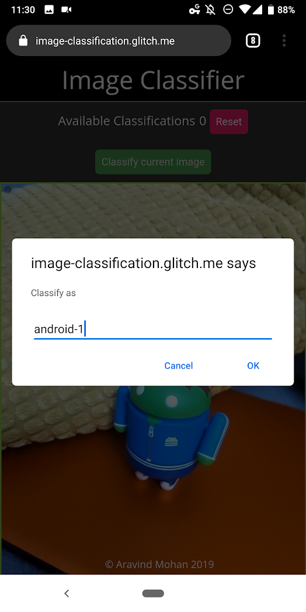
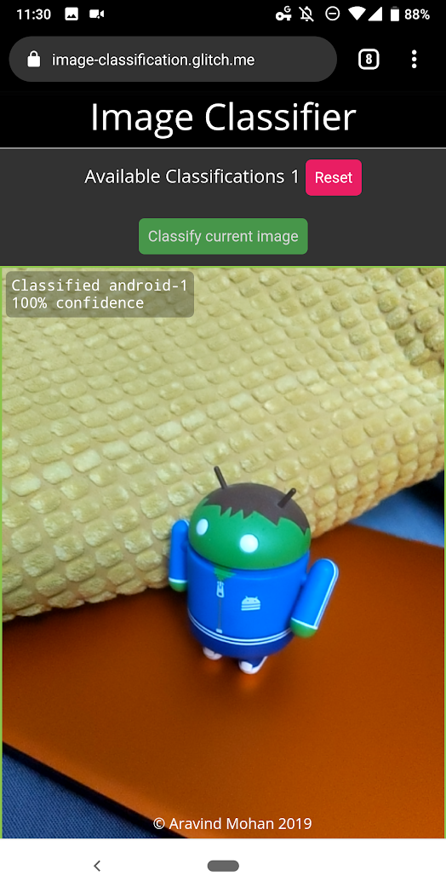
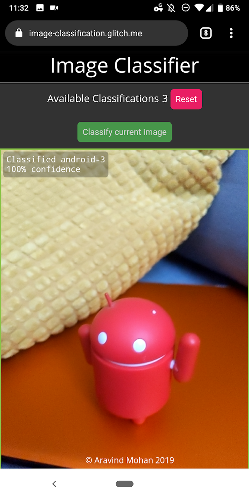

# Image Classification using Tensorflow JS

This repository contains a sample image classification using Tensorflow JS. It loads a pre-trained model to the browser and uses KNN classifier to classify any new classes that are added.

# How to use?

Host the app using any static web server or open it from [here](https://image-classification.glitch.me). It needs access to your camera to classify images so allow the required permission. Point your camera at images that you want to classify and click classify button to label it. Repeat it few times so the classifier gains more confidence on that image. Now you could do the same on a different image. Prediction is done realtime on device

## TODO

Store the sate of the classification and restore it back

## Note: No image is sent back to any server and all data are processed within the device

#### References:

https://www.tensorflow.org/js/tutorials/transfer/image_classification
